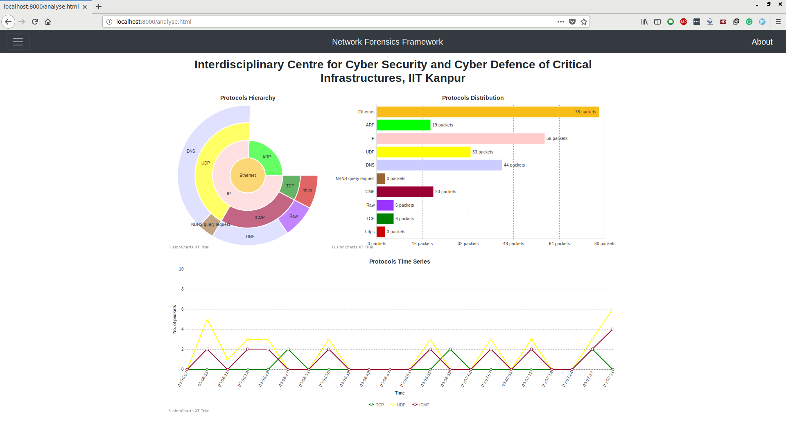

# network-forensics-framework
[](https://travis-ci.com/shivnshu/network-forensics-framework)

## Directory Structure
```
├── captures
│   └── ..............................:: sample pcap files
├── doc
|   └── ..............................:: scripts documentation
├── scripts
|   └── ..............................:: python scripts
├── webapp
|   ├── net_forensics
|   |   ├── helper
|   |   |   └── ......................:: python script acting as middleware
|   |   ├── static
|   |   |   └── ......................:: static img, css and js files
|   |   ├── templates
|   |   |   └── ......................:: django html templates for webpages
|   |   ├── fusioncharts.py ..........:: fusioncharts class declaration
|   |   ├── scripts ..................:: softlink to top level scripts folder
|   |   ├── views.py
|   ├── webapp
|   └── manage.py
├── Dockerfile
├── README.md
└── test_main.py .....................:: python tests
```

## Installation

### Docker Installation
1. In the cloned directory, run `docker build . -t <chosen-image-name>`.
2. To start the server, run `docker run -p 8000:8000 -v $(pwd):/network-forensics-framework <chosen-image-name>` from the same directory.
3. Access the web inteface through url http://localhost:8000

### Native Installation
#### NixOS
1. From the cloned directory, run `nix-shell default.nix`.
2. To start the server, run `cd webapp && python3 manage.py runserver`.
#### Others
1. First install dependencies namely `python3` and `python3-pip`.
2. Run `pip3 install -r requirements.txt`.
3. To start server, run `cd webapp && python3 manage.py runserver`.

## Screenshots


## License
See [LICENSE](https://github.com/shivnshu/network-forensics-framework/blob/master/LICENSE) for more information.
